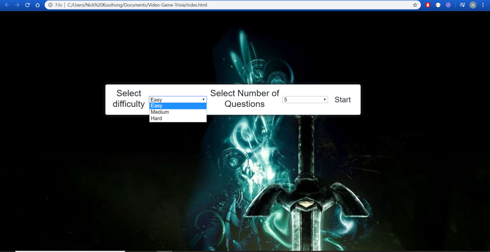

# Video-Game-Trivia

# Synopsis
A quiz that determines how knowledgeable of video games you are. 

# Code
This is a full-stack project developed using Javascript and HTML/CSS. This app consumes this API: https://opentdb.com/api_config.php in order to retrieve the trivia questions and answers.  

# App Walkthrough
## 1) The Difficulty Select Screen

Upon starting up the game the user can select from three difficulties: easy, medium and hard. Also they customize how many questions they would like to answer with their options being 5,10,15 or 20 questions. 

## 2) Question Screen

For every question the user will have 4 answers to choose from with only one of the answers being correct. 

## 3) Results Screen

The results screen shows the user how many questions they answered correctly. The message they recieve changes depending on how well they did.  
